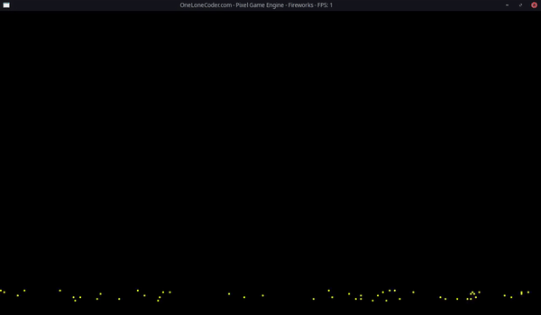

# Fireworks Display in PGE

A simple, yet pretty fireworks show, coded in C++ with the [OLC Pixel Game Engine](https://github.com/OneLoneCoder/olcPixelGameEngine)

In this repo, there are three branches. Each branch uses a different architecture for the underlying data.

| Type | Performance | Ease of writing | Extensibility | Branch |
| ---- | ---- | ---- | ---- | ---- |
| **Original/Procedural** | Best (90k) | Medium | Worst | [main](https://github.com/TechnicJelle/FireworksPGE/tree/main) |
| **OOP** | Worst (30k) | Worst | Medium | [proper-oop](https://github.com/TechnicJelle/FireworksPGE/tree/proper-oop) |
| **EnTT** | Medium (50k) | Best | Best | [port-to-entt](https://github.com/TechnicJelle/FireworksPGE/tree/port-to-entt) |

The number in the performance column here compares the amount of rockets I can spawn, before the FPS dips below 100.
